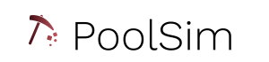

#



[](https://circleci.com/gh/samwerner/PoolSim)

## Requirements

* C++11 compiler
* [Boost iostream][boost-iostreams] (optional, to save gzip compressed results)
* [Google Test][google-test] and Google Mock (only for tests, packages `google-mock` and `libgtest-dev` on Ubuntu)

NOTE: On Ubuntu, Google Mock and Google Test must be compiled.
To install them system-wide, you can use the following commands.

```
mkdir /usr/src/googletest/build
cd /usr/src/googletest/build
cmake ..
make
make install
```

## Installation

The default install location will be `/usr/local`. You can override this
by passing the `--prefix=/path/to/install` to `./configure`.

Run the following commands to install the simulator.

```
./configure --release
make
make install
```

Depending on the location, you may need `sudo` for `make install`.
Everything can be uninstalled using `make uninstall`.

NOTE: if you get an 'error while loading shared libraries', try to run
`ldconfig /path/to/install/lib` after installing.


## Running the simulator

Simulations need a configuration file to work. A sample config file
can be found at [config.json](./config.json).

The simulator can be run with the following command.

```
poolsim --config config.json
```

You can use the `--help` flag for information about other optional flags.

## Extending the simulator

To build on top of the project, you can write new share handlers or
reward schemes and configure them in the configuration file.
The headers are in `<prefix>/include/poolsim` and a `libpoolsim.so`
shared library is provided to build on top of.

To compile your custom poolsim binary, you can write a main function like this.

```
// main.cpp
#include <poolsim/cli.h>
// #include "new_share_handler.h"
// #include "new_reward_scheme.h"

int main(int argc, char* argv[]) {
    return poolsim::run(argc, argv);
}
```

and compile it using

```
g++ main.cpp -o my-poolsim -lpoolsim
```


### Implementing a new miner behavior

Miner behaviors are currently implemented as `ShareHandler` subclasses.
However, some of the required methods have already been implemented in the
templated `BaseShareHandler` class. To create `NewShareHandler`,
we therefore recommend to use to subclass `BaseShareHandler<NewShareHandler>`.

The `ShareHandler` subclasses constructor must accept a `const nlohmann::json&`
parameter, which is populated by the `pools[N].reward_scheme.params` key in the config file.
This can be used to dynamnically custom parameters from the config file.
The `REGISTER` macro must be called from the implementation file for the
class to be found from the name set in the config file. The first
parameter must stay `ShareHandler`, as this is the type we are trying to register.
The second parameter is the name of the new class. The third parameter
is the name to be used in the config file.

While `ShareHandler` has access to the miner, this should be mostly read only
and the potential state should be kept in the implementation of `ShareHandler`.

This is the minimum code to implement a new behavior is as follow.

```c++
// new_share_handler.h
#include <nlohmann/json.hpp>
#include <poolsim/share_handler.h>

class NewShareHandler: public BaseShareHandler<NewShareHandler> {
public:
  explicit NewShareHandler(const nlohmann::json& args);
  void handle_share(const Share& share) override;
};

// new_share_handler.cpp
#include "new_share_handler.h"

NewShareHandler::NewShareHandler(const nlohmann::json& _args) {}

void NewShareHandler::handle_share(const Share& share) {
  // do greatness
}

REGISTER(ShareHandler, NewShareHandler, "some_name")
```

### Implementing a new reward scheme

Implementation-wise, reward schemes are very similar to miners' share handlers.
Reward schemes must subclass the `RewardScheme` base class and a `BaseRewardScheme`
is also provided to reduce boilerplate.

Below is the mininum code to create a new reward scheme.

```c++
// new_reward_scehme.h
#include <nlohmann/json.hpp>
#include <poolsim/reward_scheme.h>

class NewRewardScheme: public BaseRewardScheme<NewRewardScheme> {
public:
  explicit NewRewardScheme(const nlohmann::json& args);
  void handle_share(const std::string& miner_address, const Share& share) override;
};

// new_reward_scheme.cpp
NewRewardScheme::NewRewardScheme(const nlohmann::json& _args) {}

void NewRewardScheme::handle_share(const std::string& miner_address, const Share& share) {
}

REGISTER(RewardScheme, NewRewardScheme, "some_name")
```

## Configuration

PoolSim is configured via a json configuration file in the following format:

```json
{
    "output": "results.json",
    "blocks": 50000,
    "seed": 120,
    "network_difficulty": 1000000000,
    "pools": [{
        "uncle_block_prob": 0.0,
        "difficulty": 50000000,
        "reward_scheme": {
            "type": "qb",
            "params": {
                "n": 0,
                "pool_fee": 0
            }
        },
        "miners": [{
            "generator": "random",
            "params": {
                "behavior": {"name": "default"},
                "hashrate": {
                    "distribution": "lognormal",
                    "params": {
                        "mean": 0.95909,
                        "stddev": 1.742,
                        "minimum": 1.0,
                        "maximum": 1.5
                    }
                },
                "stop_condition": {
                    "type": "total_hashrate",
                    "params": {"value": 200}
                }
            }
        }]
    }]
}
```

The value for the `output` key specifies the destination of the result file produced by the simulator.
The `pools` key takes a list of mining pools that should be simulated. This can be useful when wanting to
compare the performance of miners across mining pools using different reward schemes (e.g. `qb` or queue-based, or
`pplns`). Note that a simulation containing multiple pools may contain mining pools with
different pool difficulty levels and fees.

The are two general approaches for generating miners in PoolSim. The user may either pass in a csv file containing miner
address and hash rate, or, alternatively, have the hash rates sampled from either a `normal` or `lognormal` distribution.
The parameters of the distribution need to be specified as shown in the example config.
A `minimum` and/or `maximum` can be specified for setting upper and lower bounds for the
hash rate distribution in the pool.
The hash rates are sampled until a `stop_condition` is met. This condition can be specified to be either `total_hashrate`,
which is the sum of all hash rates in a pool, or `miners_count`, which refers to the total number of miners in a pool.

The mining strategies, or the miner `behaviour`, may be specified as the respective value. 
The `default` behaviour does not specify any mining strategy, i.e. honest mining. 
Other behaviours may be defined on a custom basis.


## Contributing

### Development build

Run

```
./configure
make
```

The executable will be at `build/poolsim`.

### Running the tests

Tests require Google Test and Google Mock.
Running

```
make test
```

should run and execute the tests.

## Progress

- [x] Simulator core logic
- [x] Config parser
- [x] Network difficulty
- [x] Pool
  - [x] Difficulty
  - [x] Uncle block prob
- [x] Miners
    - [x] From CSV
    - [x] From distribution
        - [x] Normal distribution
        - [x] Uniform distribution
- [x] Result serialization
- [x] Reward schemes
    - [x] PPS
    - [x] PPLNS
    - [x] QB
    - [x] PROP
- [x] Miner behaviors
    - [x] Default
    - [x] Withholding of valid shares (block withholding)
    - [x] Stop submission of shares
    - [x] Donation of shares to a different address
    - [x] Pool hopping
        - [x] Luck based
        - [x] Average credit lost based
- [ ] Multiple simulations per run
    - [ ] Config file scheme
    - [ ] Simulator implementation

[google-test]: https://github.com/google/googletest
[boost-iostreams]: https://www.boost.org/doc/libs/1_69_0/libs/iostreams/doc/index.html
